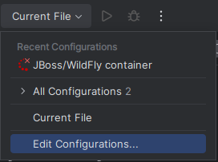
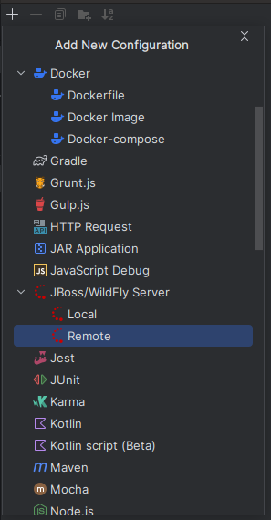
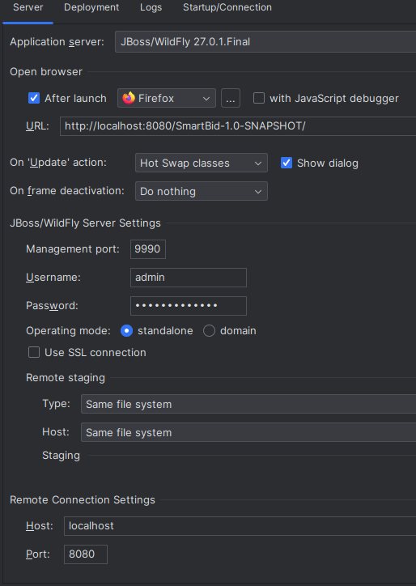
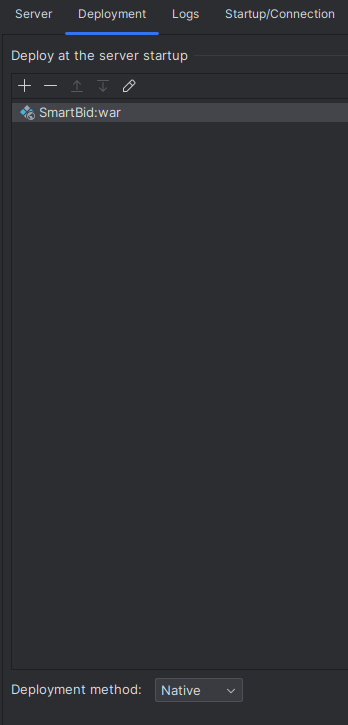
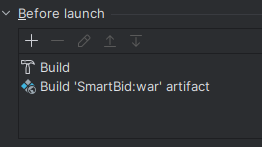
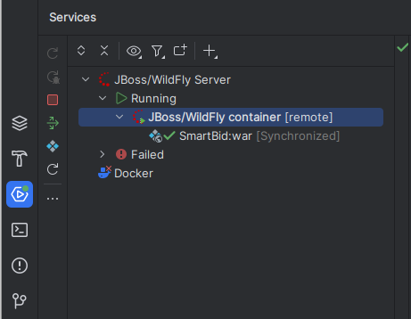

# 2023-SmartBid
Assignment for the 2023 edition of the "Web Development and the Semantic Web" course, by Abraão Jesus dos Santos, Delma Assis dos Santos Barboza and Igor Sunderhus e Silva.
O SmartBid é uma aplicação tem como objetivo o cadastro e execução de licitações na modalidade de pregão eletrônico. Tendo a competência de cadastrar pregões eletrônicos, executar as propostas e obter os vencedores.

## O que é necessário para executar o projeto:

- [JDK 17+](https://www.oracle.com/br/java/technologies/downloads/#java17)
- [Maven 3.8.8](https://maven.apache.org/download.cgi)
- [Docker 20.10.21](https://docs.docker.com/get-docker/)
- Docker-compose 1.25.0


Nota: Se você estiver usando ubuntu, pode instalar o docker e o docker-compose com os seguintes comandos:

```sudo apt install docker.io```

```sudo apt install docker-compose```

## Como executar o projeto

### Passo 1: Clone o repositório

```git clone https://github.com/dwws-ufes/2023-SmartBid.git```

### Passo 2: Buildar o projeto

```mvn clean install```

### Passo 3: Buildar a imagem do wildfly

```docker build -t smartbid-wildfly .```

### Passo 4: Execute o docker-compose do projeto na pasta raiz

```docker-compose up -d```

### Passo 5: Acesse a aplicação pelo navegador

```http://localhost:8080/SmartBid-1.0-SNAPSHOT/index.xhtml```

### EXTRA: Configuração do JBoss no IntelliJ (para devs)

#### Passo 1: Current File -> Edit Configurations



#### Passo 2: + -> JBoss Server -> Remote



#### Passo 3: Server Configs



#### Passo 4: Deployment Configs

Nota: Deployment method tem que estar como **'Native'**!!



#### Passo 5: Before Launch Configs



#### Passo 6: Em Services (Alt + 8) clique com o botão direito no Jboss 'container' e adicione o SmartBid:war como Artifact



